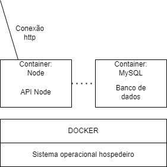

# Sobre

Trabalho Prático da disciplina de Sistemas Distribuídos da Universidade Federal de Lavras (UFLA), lecionada pelo professor André de Lima Salgado.

O objetivo deste trabalho é apresentar o Docker, uma tecnologia de virtualização por containêres, e demonstrar sua funcionalidade por meio de uma aplicação prática. 

Ao final do projeto, esperamos que seja possível ter uma compreensão sólida do Docker, seus benefícios e a forma como facilita o desenvolvimento, implantação e execução de aplicações distribuídas.

Dessa forma, criamos uma aplicação que pode demonstrar um pouco da utilização do docker em si. 
<br><br>

- __Material de Apoio: Slides__
```shell
  ├── documentos
     └── Slides_Docker.pdf
```

# Docker
<div align="center">
  
</div>
O Docker é uma plataforma de software livre que permite aos desenvolvedores desenvolver, implementar, executar, atualizar e gerenciar componentes de contêineres executáveis e padronizados que combinam o código-fonte de aplicativos com as bibliotecas e estruturas do sistema operacional (S.O.) necessárias para executar o código em qualquer ambiente.<br>
Os contêineres, por sua vez, simplificam o desenvolvimento e a entrega de aplicativos distribuídos. Além disso, os desenvolvedores podem criar contêineres sem o Docker, trabalhando diretamente com recursos integrados ao Linux e outros sistemas operacionais. Porém, o Docker torna o processo de conteinerização mais rápido, fácil e seguro!
<br>

O Docker é tão utilizado atualmente que "Docker" e "contêineres" são usados como sinônimos. Isso se deve ao fato do Docker permitir aos desenvolvedores acessar esses recursos nativos de conteinerização usando comandos simples e automatizá-los por meio de uma interface de programação de aplicativos (API) que reduz a carga de trabalho.
<br>
<br>
Por que utilizar o Docker?
- Portabilidade de contêiner aprimorada e contínua
- Mais leve e com atualizações mais granulares
- Criação automatizada de contêineres
- Controle de versões de contêineres
- Bibliotecas compartilhadas de contêineres


# Visão Arquitetônica do Sistema
<p align="center">
	
</p>


# Tecnologias


# API
Nesse sistema existem 2 containeres, o primeiro com o mysql e o segundo com o node. O node irá criar uma API para consumir as informações do Banco de Dados.


# Instalação
- MYSQL
  
Construir a imagem do mysql docker, para isso vamos executar o seguinte comando na pasta raiz do projeto
> -t : usado para dar tag/nome para a imagem | -f : caminho do dockerfile e o '.' é porque queremos buildar na pasta em que estamos, no caso a raiz
```
build -t mysql-image -f api/db/Dockerfile . 
```
  
Executar o container com persistencia de dados
```
docker run -d -v $(pwd)/api/db/data:/var/lib/mysql -rm --name mysql-container mysql-image
```

Adicionar um IP para o container contendo o mysql   
 ```
docker inspect -f '{{range.NetworkSettings.Networks}}{{.IPAddress}}{{end}}' mysql-container
```
    
[opcional] Executar comandos no container para checar o bando de dados
```
docker exec -it mysql-container /bin/bash
```

Executar o script sql
```
docker exec -i mysql-container mysql -uroot -p1234 < api/db/script.sql
```
</br>


- NODE

Para preparar o ambiente de instalação:
- Instale o [Node.js](https://nodejs.org/en/), na versão 12 em seu computador.

Dentro da pasta ap
```
- npm init
```

Instalar nodemon para dar reload automático toda vez que atualizarmos os arquivos JavaScript
```
npm install --save-dev nodemon
```

Instalar o express para criar a api e o driver do mysql
```
npm install --save express mysql
```

> + criar o comando "start": "nodemon ./src/index" no package.json

Rodar o dockerfile do node (na pasta raiz do projeto) 
> Observação: pode ser nescessário rodar como superusuário
```
docker build -t node-image -f api/DockerfileNode .
```

Rodar um container com a imagem
> '-p' serve para conectar a porta 9001 do container com a porta 9001 da nossa maquina, para que o node possa receber requisições
```
docker run -d -v $(pwd)/api:/home/node/app -p 9001:9001 --rm --name node-container node-image
```

Por fim, só acessar o endereço: **http://localhost:9001/products**


# Referências Utilizadas
Vídeo utilizado para apoio do código: 

https://www.youtube.com/watch?v=Kzcz-EVKBEQ&t=219s

ChatGPT utilizado para resolver bugs relacionados ao código: 

https://chat.openai.com

Documentação do Docker: 

https://docs.docker.com/get-started/

Sites de apoio:

https://www.hostinger.com.br/tutoriais/o-que-e-docker

https://www.ibm.com/br-pt/topics/docker


# Autores
<table style="width: 100%;">
  <tr>
    <td style="text-align: center;"><a href="https://github.com/Eduardo-Cezar">Eduardo Cezar</a></td>
    <td style="text-align: center;"><a href="https://github.com/ingridfalchii">Ingrid de Falchi</a></td>
    <td style="text-align: center;"><a href="https://github.com/LeoJunioYuri">Leonardo Basso</a></td>
    <td style="text-align: center;"><a href="https://github.com/kdaon">Olivia Campos</a></td>
  </tr>
</table>
